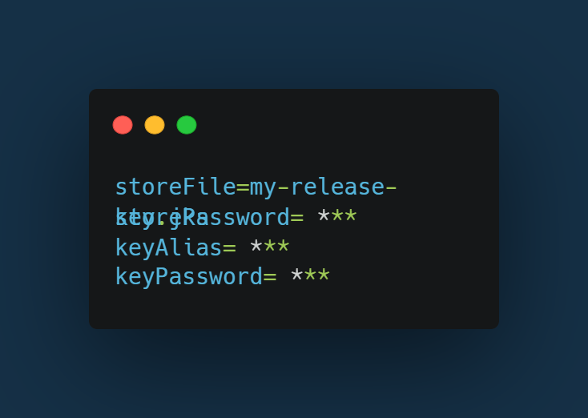

# Android Build, Signing, and PlayStore Deployment

<a href="#table-of-contents" style="width:100%"></a>

## Pre Requirements

Before publishing an Android App to Play Store, you must have an Android folder in your app to follow the steps correctly.

### Android Folder in root folder

1. Install Capacitor.

```sh
ng add @capacitor/angular
```

2. Build the Web App.

```sh
ng build --prod
```

3. Install the native platforms you want to target.

```sh
npm i @capacitor/android
npx cap add android
```

## Android With Fastlane

Now at this stage we are ready to proceed for the Android build after encapsulating the overall process from generating the key for the signed builds. In order to deploy the build to the Google play console, we used Fastlane (The easiest way to build and release mobile apps, fastlane handles tedious tasks so you don’t have to).
Following steps need to be followed:

### Fastlane Configurations

1. Firstly install the Fastlane in respective OS (mac/windows/linux).
2. Ruby must be installed in the system for installing fastlane init.
3. After setting up the fastlane package, now you are good to go towards the real essence of fastlane.
4. Initialize the fastlane using “fastlane init” in the Android folder present in the root ./android of the project.
5. You will see the directory fastlane having 2 files named Appfile and Fastfile.

### Creating Play Console Credentials

To connect fastlane with Play Console, you need to provide appropriate credentials in the form of an API key file (JSON). This file contains the credentials that fastlane will use to connect to your Google Play Console account and make updates on your behalf.

To create a key file, follow these steps from the [fastlane official documentation](https://docs.fastlane.tools/getting-started/android/setup/#collect-your-google-credentials). Once your key file is created, you can connect fastlane with your Google Play Console APIs.

1. You can validate your key using the command:

```sh
fastlane run validate_play_store_json_key json_key:/path/to/your/downloaded/file.json
```

2. Next, add your key file to fastlane. Open the fastlane/Appfile and update the json_key_file property with your key file location.

```sh
json_key_file("./api-key.json")
```

### Additional Credentials

To sign the Build, you must have these files:

1. keystore.properties (in android/keystore.properties), in the following format:
   

2. my-release-key.jks (in android/app/my-release-key.jks)

How to Sign your app,follow steps from the following link:
https://developer.android.com/studio/publish/app-signing

### Writing Fastlane lane

Open Fastfile and write lanes for testing, increment version code, and deploying.
Some Lanes are already written in fastlane/Fastfile

#### Example lane executed as

Run

```sh
fastlane run_unit_tests
```

### Increment version code

Versioning is much easier with fastlane; you simply need to add the plugin shown below:

```sh
fastlane add_plugin increment_version_code
```

Once the plugin is installed, open your Fastfile and add a lane to increment the version code automatically, In this lane fastlane first gets the deployed version code on google play store and increment the version code.

Run

```sh
fastlane increment_version_code_in_project_gradle
```

### Deployment

1. Google Play console changed its policy of accepting only AAB file rather than APK file, so the bundleRelease command will generate the aab file.
2. You need to first upload the aab file to Google play manually, following all the policy guidelines, so that Fastlane can handle the automating the deployment to Google Play after that.
3. In this case aab file manually uploaded to Internal Testing , Please make sure the package name should be defined in aab file must be similar to when initializing the fastlane init at the very start.
4. Similarly "fastlane deploy" lane in Fastfile handles everything for the next deployements mentioned in above steps.

Run

```sh
fastlane distribute_playstore
```

5. After Successful completion of fastlane

You will see the message in the terminal "fastlane.tools finished successfully"

6. You can direct to Google play console dashboard to see the recent release published through fastlane.
7. That’s it, we have successfully managed to deploy the application.

### Wrapping All in one Lane

In the respective all the previous lane are executed in the following order:

1. Test lane.
2. Increment Version Code.
3. Build an AAB.
4. Distribute to Play Store.

Run

```sh
fastlane build_and_distribute
```
