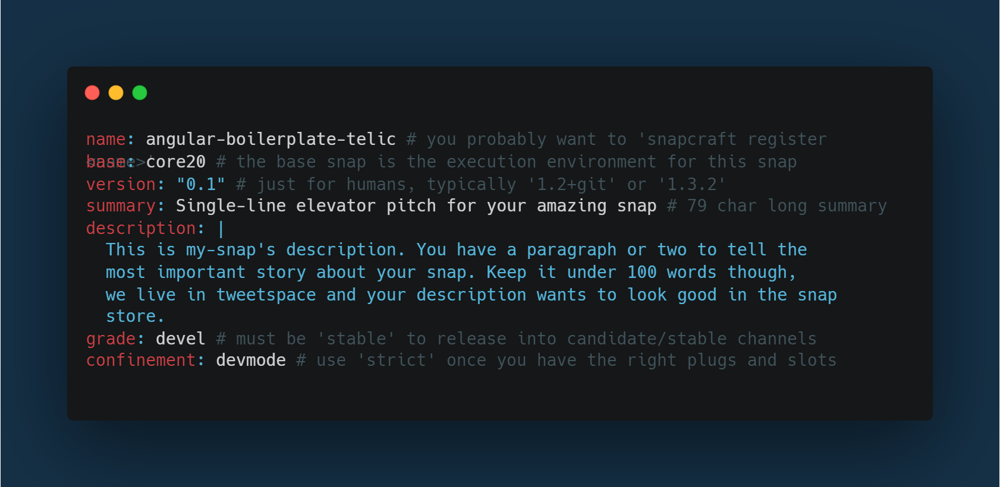

# Linux Electron App build, Snapcraft Release, and Actions

## Build and Release

Clone the repo

```sh
git clone https://github.com/TelicSolutionsInc/AngularBoilerplate.git
```

Run npm install

```sh
npm install
```

Firstly build the project before building the package.

```sh
npm run build
```

Install snapcraft for releasing .snap of your electron app to Snapcraft

```sh
sudo apt update
sudo apt install snapd

brew install snapcraft
```

Run snapcraft init to setup snap/snapcraft.yaml

```sh
snapcraft init
```

Register your app name, following steps from this link
https://snapcraft.io/docs/registering-your-app-name

Then set "name" key with registered app name in ./package.json


Also set "name" key with registered app name in snap/snapcraft.yaml


Run npm run package-linux to build .snap file of your Electron App

```sh
npm run package-linux
```

A "release-builds" folder will be created in the root directory of your project having linux folder with .snap file of your electron app.

Return to the terminal and the location of your .snap file ("release" folder). You now need to authenticate the snapcraft command using your Snapcraft developer account credentials. This can be accomplished with the following:

```sh
snapcraft login
```

Next, upload the snap and release it into the stable channel, replace <snap-file-name> with your built snap. You can find the file in release folder
e.g(mysnap_0.0.0_amd64.snap):

```bash
snapcraft upload --release=stable <snap-file-name>.snap
```

Congratulations, your snap has now been released and is available on the Snap Store
You can also install your app via:

```sh
sudo snap install <app-name>
```

## Actions

This is a Github Action that can be used to publish [snap
packages](https://snapcraft.io) to the Snap Store built by [snapcore](https://github.com/snapcore/action-publish).


Actions for Linux:

```sh
name: Linux Deploy on Merge
on:
  push:
    branches: [ master ]
jobs:
  Linux-deploy:
    runs-on: ubuntu-latest
    steps:
      - name: Checkout
        uses: actions/checkout@v2
      - name: cache node module
        id: myCacheStep
        uses: actions/cache@v2
        env:
          cache-name: cache-node-modules
        with:
          path: node_modules
          key: ${{ runner.os }}-build-${{ env.cache-name }}-${{ hashFiles('**/package-lock.json') }}
          restore-keys: |
            ${{ runner.os }}-build-${{ env.cache-name }}-
            ${{ runner.os }}-build-
            ${{ runner.os }}-
      - name: Install Dependencies
        if: steps.myCacheStep.outputs.cache-hit != 'true'
        run: npm install
      - name: Build Using npm
        run: node_modules/.bin/ng build
      - name: snap package
        run: npm run package-linux
      - uses: actions/checkout@v2
      - uses: snapcore/action-build@v1
        id: build
      - uses: snapcore/action-publish@v1
        with:
          store_login: ${{ secrets.STORE_LOGIN }}
          snap: ${{ steps.build.outputs.snap }}
          release: edge
```

This action is already written in [.github/workflows/sanpcraft.yaml](https://github.com/TelicSolutionsInc/AngularBoilerplate/blob/master/.github/workflows/deploy-linux.yml), you have to first produce data using command below:

```sh
$ snapcraft export-login --snaps=PACKAGE_NAME \
      --acls package_access,package_push,package_update,package_release \
      exported.txt
```

This will produce a file `exported.txt` containing the login data,
which should be a multi-line file starting with `[login.ubuntu.com]`.

In order to make the credentials available to the workflow, they
should be stored as a repository secret:

1. choose the "Settings" tab.
2. choose "Secrets" from the menu on the left.
3. click "Add a new secret".
4. set the name to `STORE_LOGIN`, and paste the contents of `exported.txt` as the value.


This will build the project, upload the result to the store, and
release it to the `edge` channel.
