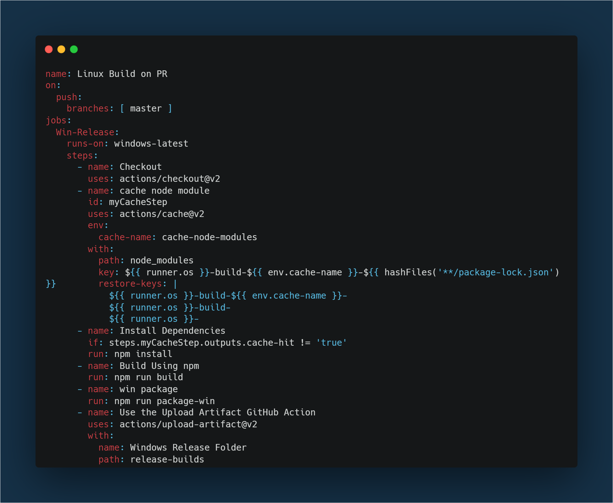

# Windows Electron App build, Github Release with Actions

## Build and Release

Clone the repo

```sh
git clone https://github.com/TelicSolutionsInc/AngularBoilerplate.git
```

Run npm install

```sh
npm install
```

Firstly build the project before building the package.

```sh
npm run build
```

Run npm run package-win to build .exe file of your Electron App

```sh
npm run package-win
```

A "release-builds" folder will be created in the root directory of your project having windows folder with .exe file of your electron app.
You can directly execute the .exe file to open the application in Windows.

### Actions

This is a Github Action that can be used to build and then release the Windows package as an artifact on Github Actions tab.


Actions for Windows:

```sh
name: Linux Build on PR
on:
  push:
    branches: [ master ]
jobs:
  Win-Release:
    runs-on: windows-latest
    steps:
      - name: Checkout
        uses: actions/checkout@v2
      - name: cache node module
        id: myCacheStep
        uses: actions/cache@v2
        env:
          cache-name: cache-node-modules
        with:
          path: node_modules
          key: ${{ runner.os }}-build-${{ env.cache-name }}-${{ hashFiles('**/package-lock.json') }}
          restore-keys: |
            ${{ runner.os }}-build-${{ env.cache-name }}-
            ${{ runner.os }}-build-
            ${{ runner.os }}-
      - name: Install Dependencies
        if: steps.myCacheStep.outputs.cache-hit != 'true'
        run: npm install
      - name: Build Using npm
        run: npm run build
      - name: win package
        run: npm run package-win
      - name: Use the Upload Artifact GitHub Action
        uses: actions/upload-artifact@v2
        with:
          name: Windows Release Folder
          path: release-builds
```

This will produce a zipped folder for the respective action.
